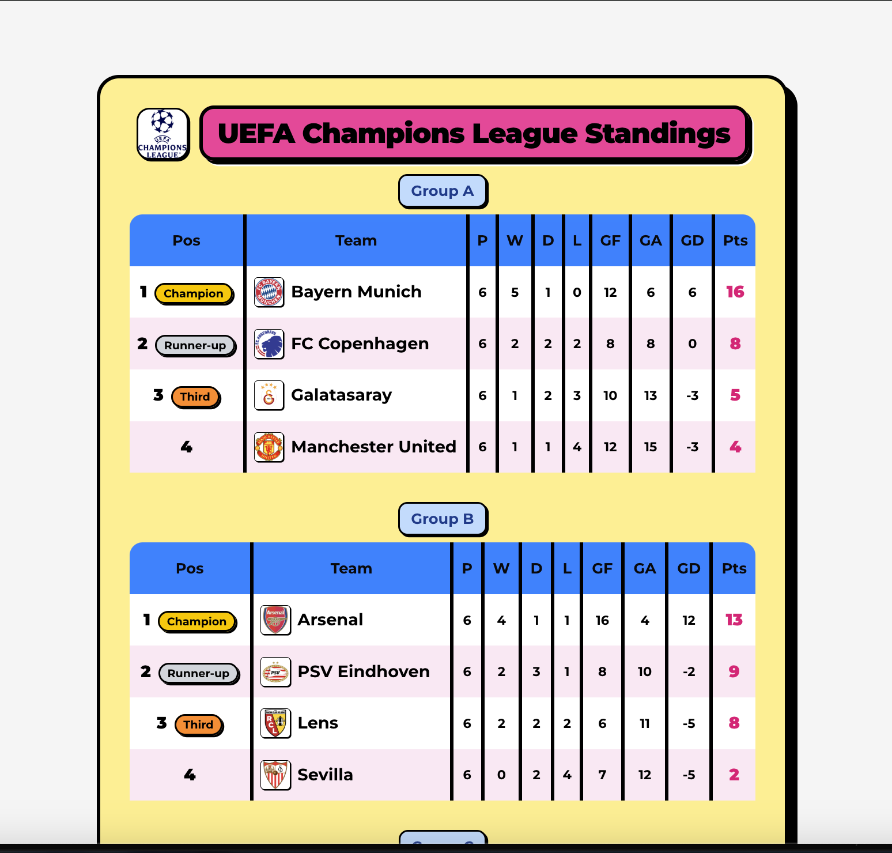

# Live Standing Score



Aplikasi web untuk menampilkan standing liga sepak bola secara real-time dengan tampilan modern neo-brutalism, dibangun menggunakan React, TailwindCSS, dan shadcn/ui.

## Fitur
- Tabel standing liga sepak bola real-time dari API Football.
- Responsive dan mobile friendly.
- Tampilan modern neo-brutalism.
- Menampilkan logo liga dan logo tim.
- Support multi group (misal: Group A, B, dst).
- Loading state dan error handling di console.

## Screenshot


## Instalasi & Menjalankan
1. **Clone repo**
   ```bash
   git clone <repo-url>
   cd live-standing-score
   ```
2. **Install dependencies**
   ```bash
   npm install
   # atau
   yarn install
   ```
3. **Buat file .env**
   Tambahkan API key dari [api-football](https://dashboard.api-football.com/) ke file `.env`:
   ```env
   VITE_FOOTBALL_API_KEY=your_api_key_here
   ```
4. **Jalankan aplikasi**
   ```bash
   npm run dev
   # atau
   yarn dev
   ```

## Stack
- React + Vite
- TailwindCSS
- shadcn/ui
- API Football (api-sports.io)

## Lisensi
MIT
